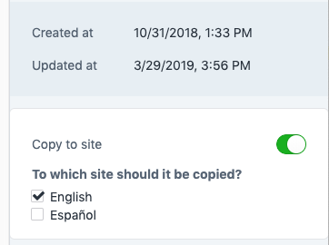
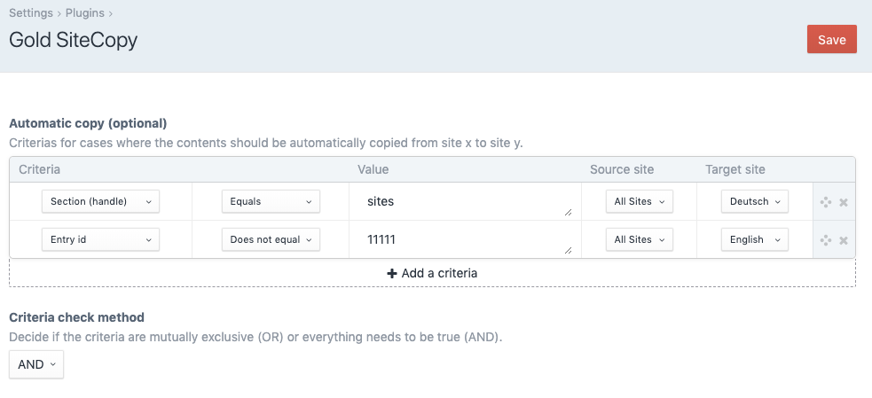

# SiteCopy for Craft CMS

This plugin makes it easy to copy the content of an entry from a site to another.

## Using the SiteCopy plugin

### Copy entry to another site

When editing an entry at the bottom of the right panel you will find a toggle to enable
site syncing. From there select the site that you want to overwrite with the currently
visible content and then just save the entry like normal. Any content of the current
site will be automatically copied to the selected site.

It's even possible to copy the current entry to multiple sites. 

As the copy will trigger a queue the copy might be not instantaneous. 

***Attention:*** This action will OVERWRITE all content from the selected site.

### Global Sets

In addition to entries, you can also copy global sets. You will find the toggle at the very bottom of the global set content.

### Craft Commerce

This plugin is compatible with Craft Commerce products.

### Choose the content you want to be copied
In the plugin settings you can configure the content that gets copied from the current entry.
Per default it copies only the entries content (without meta data like title and slug)

### Activate automatic copy for specific entries

In the plugin settings you can configure the automatic copy function. 
With this you can configure if some entries should be automatically set
to be copied to a specific site. 

You can set criterias in the plugin settings for automatically activating the "copy to site" toggle on load of an entry.

## Requirements

This plugin requires Craft CMS 3.2 or later.

## Installation

Install using `composer require goldinteractive/craft3-sitecopy` 
